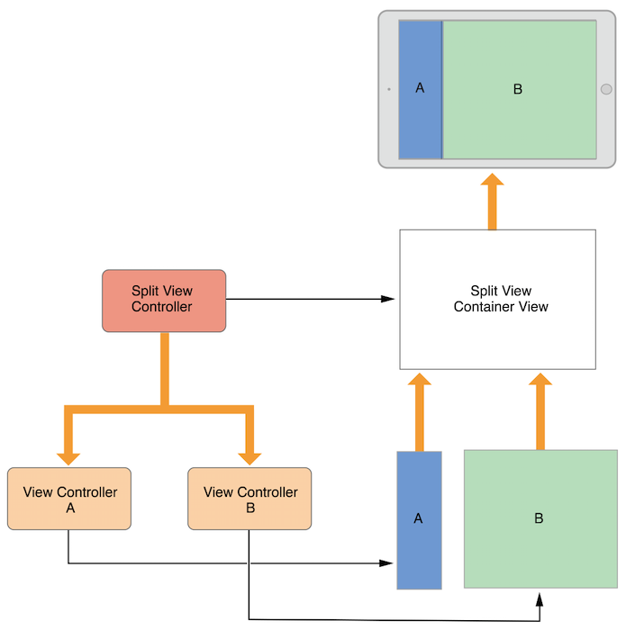
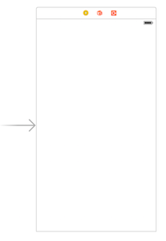
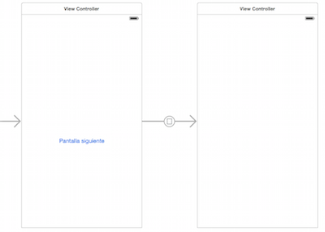

# Interfaz de usuario en dispositivos móviles
## iOS, sesión 1: View controllers

---

Recordemos que los *controllers* son **el “pegamento” que relaciona la vista con el modelo**. Contienen el código que:

- Reacciona a los eventos del usuario 
- Modifica la vista.
- Le pide al modelo que "haga cosas"

---

**Aclaración**

Apple usa el confuso término "View Controller" para referirse al controlador de una vista. **El *view controller* es la C**, no la V del MVC


---

## Puntos a tratar

- Introducción. Tipos de *controllers*
- Ciclo de vida
- *Storyboards* y *segues*

---

## Relación entre *view* y *view controller*

 

---

## Tipos básicos de *controllers*

- Los que muestran directamente contenido (*content controllers*)
- Los que contienen otros controladores (*container controllers*).

---

 


---

## 2. Estructura básica del código de un *controller*


---


Un *controller* no es más que una **clase que hereda de `UIViewController`**. Podemos escribirla nosotros o ser propia de Cocoa

```swift
class MiViewController : UIViewController {
   //Definición de la clase
}
```

Para enlazar este código con la pantalla que se ve en el *storyboard* se usa el *identity inspector*. Como `Custom class` hay que poner la que hemos hecho.

---

## Métodos del ciclo de vida de un *controller*

```swift
loadView()
viewDidLoad()
viewDidUnload()
viewDidAppear()
viewWillAppear()
didReceiveMemoryWarning()
```

---

## `viewDidLoad()`

- Se llama una única vez tras cargar el controlador en memoria
- Se suele aprovechar para inicializar propiedades, rellenar la vista con contenido si son datos dinámicos, etc.

---

## `viewDidAppear()`

- Se llama cada vez que se muestra la vista asociada al controlador
- Típicamente usada para iniciar animaciones

---

## `loadView()`

- Solo se usa si queremos crear los componentes de la interfaz por código

```swift
override func loadView {
    vista = UIView(frame:UIScreen.main.applicationFrame
    vista.backgroundColor = UIColor.greenColor
    self.view = vista;
 }
```

---


## Posibilidades para crear la interfaz de usuario

-  **Storyboards**, (por defecto). representan las “pantallas” de nuestra aplicación y el flujo de navegación entre ellas. 
- **NIBs**: representan una “pantalla” concreta de nuestra aplicación,  asociada a un *view controller*. Pasar de una pantalla a otra (de un *view controller* a otro) es responsabilidad del desarrollador. 
- **Vistas programáticas**: crear por código las vistas y subvistas que componen la interfaz.

---


## 3. Storyboards y *segues*


---


## Añadir una "pantalla" a nuestra aplicación

- Parte superior derecha de la pantalla, botón `Library`: todos los objetos que contienen en su nombre "View controller"

 <!-- .element class="stretch" -->

---


## Cambiar la clase del controller

- Por defecto, las clases de las nuevas pantallas serán propias de Cocoa: `UIViewController`, `UITableViewController`,... 
- En general las cambiaremos por las nuestras, para poder escribir nuestro propio código.

 


---

- **Controlador inicial:** la "pantalla" que se va a mostrar al inicio de la aplicación (sin contar la de *splash*)

 

---

## Segues

Transiciones entre controladores. Se pueden crear con `Ctrl+arrastrar` entre el elemento que debe disparar la transición y el controlador destino

 


---

## Pasar de un controlador a otro

- Al seguir un *segue*, el cambio de controlador es automático
- Cuando se va a cambiar de un controlador a otro iOS llama a `prepareForSegue:sender`. 

```objectivec
override func prepare(for segue: UIStoryboardSegue, sender: Any?) {
        print("cambiamos de pantalla")
}
```

---


## Pasar datos entre controllers

Normalmente en un *controller* al que llegamos a través de un *segue* queremos mostrar información relacionada con el *controller* anterior. ¿Cómo pasamos los datos?

1. Definimos una propiedad en el controller destino
2. En el `prepareForSegue:sender` modificamos el valor de la propiedad desde el *controller* origen
3. Cuando llegamos al destino, en la propiedad tenemos la información deseada

---

Supongamos dos *controllers*, `ViewController1` y `ViewController2` conectados por un *segue*. Primero definimos la propiedad en el destino

```swift
class ViewController2 : UIViewController {
    var mensaje = ""

    override func viewDidLoad() {
        super.viewDidLoad()
        print(self.mensaje)
    }
}
```


---

En el momento de la transición, modificamos la propiedad del *controller* destino

```swift
override func prepare(for segue: UIStoryboardSegue, sender: Any?) {
    if (segue.identifier=="siguiente") {
        if let vc2 = segue.destination as? ViewController2 {
            vc2.mensaje = "Bienvenidos a la pantalla 2"
        }
    }
}
```
---

## Volver atrás en un *segue*

**Paso 1**. Implementar en el *controller* al que se vuelve un método que devuelva un `IBAction` y tenga como único parámetro un `UIStoryboardSegue *`. No es necesario que el método haga nada en especial. Simplemente sabemos que se ejecutará cuando se vuelva atrás.

```swift
@IBAction func retornoDeSecundaria(segue: UIStoryboardSegue) {
    print("volvemos atrás")    
}
```

---

## Volver atrás en un *segue* (II)

**Paso 2**. `Ctrl+Arrastrar` desde el elemento de interfaz que queremos que desencadene el *unwind*, hasta el icono de `Exit` 


