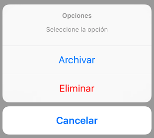

# Interfaz de usuario en dispositivos móviles
## iOS, sesión 2: Vistas

---

## Puntos a tratar

1. Vistas y jerarquía de vistas
2. Propiedades de una vista
3. Controles de usuario básicos

---

## Vistas y jerarquía de vistas


Del libro ["Modern Auto Layout", Keith Harrison](https://gumroad.com/l/albook)

 <!-- .element: class="stretch" --> 

---

## Vistas y jerarquía de vistas en Xcode


---

## 2. Propiedades de una vista


---

## Sistema de coordenadas

 <!-- .element class="stretch" -->

- Las coordenadas se dan en *puntos* y no en pixels físicos para independizarse en lo posible del dispositivo
- [resoluciones de dispositivos iOS](http://iosres.com)


---


## Algunas propiedades geométricas de las vistas

```swift
//Limites en coordenadas locales
//Su origen siempre es (0,0)
//Aclaración: CGRect tiene 4 campos: x, y, width y height
CGRect areaLocal = vista.bounds
print("\(arealocal.width)x\(arealocal.height)")
// Posición del centro de la vista en coordenadas de su supervista
CGPoint centro = vista.center
// Marco en coordenadas de la supervista
CGRect marco = vista.frame
```

---

## Color, transparencia, estado...

```swift
boton = UIButton()
boton.backgroundColor = UIColor.red
boton.alpha = 0.5   //Transparencia del 50%
boton.isHidden = true; //Lo ocultamos, ya no se ve ni recibe eventos
boton.isHidden = false;
boton.isEnabled = true; //Lo deshabilitamos
```

---

## 3. Controles de usuario básicos


---

La clase `UIControl` es de la que heredan los controles más “interactivos” como los botones, mientras que las etiquetas lo hacen de `UIView` (no obstante todos los`UIControl` son también vistas ya que a su vez esta clase hereda de `UIView`).

Referencia: [Interface Essentials](https://developer.apple.com/design/human-interface-guidelines/ios/overview/interface-essentials/), de Apple

---

## Mensajes al usuario

- **Alertas**: ofrecen información al usuario o la posibilidad de elegir opciones
- **Action sheets**: ante una acción a realizar, dan a los usuarios la posibilidad de seguir cursos alternativos 

Las alertas suelen ser inesperadas para el usuario. Sin embargo las *action sheet* aparecen en respuesta a una acción y por tanto son esperables


---

## Alert


---


## UIAlertController

Sirve tanto para alertas como para *action sheets*

```swift
//El alert en sí. Vemos que el preferredStyle es .alert
let alert = UIAlertController(title: "Hola amigo", 
            message: "Elige, por favor", 
            preferredStyle: .alert)
//cada opción es un UIAlertAction
let susto = UIAlertAction(title: "Susto", style: .cancel) {
    action in
      print("BU!!! haber elegido muerte!")
}
let muerte = UIAlertAction(title: "Muerte", style: .default) {
    action in
      print("Aquí se acaba todo")
}
//Añadimos las opciones al cuadro de diálogo
alert.addAction(susto)
alert.addAction(muerte)
//Mostramos el alert con present, como se hace con cualquier controller
self.present(alert, animated: true) {
    print("Ha desaparecido el alert")
}
```

---

## Action sheet

<!-- .element class="stretch" -->


---

```swift
let actionSheet = UIAlertController(title: "Opciones", 
    message: "Seleccione la opción", 
    preferredStyle: .actionSheet)
let archivar = UIAlertAction(title: "Archivar", style: .default){
            action in
            print("Aquí se archivaría el mensaje")
}
let eliminar = UIAlertAction(title: "Eliminar", style: .destructive) {
            action in
            print("Aquí se eliminaría el mensaje")
        }
let cancelar = UIAlertAction(title: "Cancelar", style: .cancel) {
            action in
            print("Aquí no se haría nada")
}
actionSheet.addAction(archivar)
actionSheet.addAction(eliminar)
actionSheet.addAction(cancelar)
self.present(actionSheet, animated: true) {
   print("Ha desaparecido el action sheet")
}
```

---


## Teclado en pantalla

Un problema típico es cómo "quitarlo de enmedio". Para quitarlo al pulsar sobre "intro"

* Crear un *action* con `Ctrl+Arrastrar` entre el campo y el controller. En el menú desplegable elegir el evento `Did end on exit`, y el `type` `UITextField`
* En el *action* hacer

```swift
@IBAction func introPulsado(_ sender: UITextField) {
     sender.resignFirstResponder()
     //También valdría esto
     self.view.endEditing(true)
     //O incluso no hacer nada!!
}  
```

---

## Otra forma de hacerlo

- Usando el `UITextFieldDelegate`. El método `textFieldShouldReturn` es el que se llama cuando se pulsa intro.

```swift
class ViewController: UITextFieldDelegate {
   //El outlet vinculado con el campo de texto 
   @IBOutlet weak var campoTexto: UITextField!

   override func viewDidLoad() {
        super.viewDidLoad()
        self.campoTexto.delegate = self
   } 

   func textFieldShouldReturn(_ textField: UITextField) -> Bool {
     textField.resignFirstResponder()
     return true 
   }
}
```


---

## Teclado sin intro o text view

- El teclado numérico no tiene intro, y en los *text view* de varias líneas se debería permitir al usuario que pulsara INTRO para añdir nuevas líneas. 
- Podemos hacer que se oculte cuando se hace *tap* en el background

```swift
//en el view controller
override func touchesEnded(_ touches: Set<UITouch>, with: UIEvent?) {
    print("¡¡touch en la pantalla!!");
    //busca el first responder y hace que deje de serlo
    self.view.endEditing(true);
}
```

---

Para saber cuándo cambia el valor de la mayoría de los controles usamos *actions*, como ya hemos visto con botones y campos de texto. Esto se usa por ejemplo con *sliders* (`UISlider`), *switches* (`UISwitch`) o *date pickers* (`UIDatePicker`):

```swift
//Este método se ha creado con el "assistant editor" y Ctrl+Arrastrar
//de la ventana del storyboard al editor con el código del view controller
//Elegimos Connection "action" y type "UISlider"
@IBAction func cambiaSlider(_ sender: UISlider) {
    print("El valor es: \(sender.value)")
}
```

---


El `Picker` es un control algo más complejo ya que requiere de dos "ayudantes" (objetos que implementan ciertos protocolos)

- Un *delegate* (protocolo `UIPickerViewDelegate`): gestiona el comportamiento general del *picker*
- Un *datasource* (protocolo `UIPickerViewDataSource`): gestiona el "modelo de datos": cuántas filas y columnas tiene

Estos dos protocolos heredan de `NSObjectProtocol` con lo que los objetos conformes a ellos deben ser conformes también a este último (esto se consigue de modo sencillo heredando de `NSObject`)

---


```swift
class GestorPicker : NSObject, UIPickerViewDelegate, UIPickerViewDataSource {
    var lista = ["Pepe", "Eva", "Juan", "María"]

    //METODOS DE UIPickerViewDelegate
    //número de "columnas" del Picker
    func numberOfComponents(in pickerView: UIPickerView) -> Int {
        return 1
    }
    //número de "filas"
    func pickerView(_ pickerView: UIPickerView, numberOfRowsInComponent component: Int) -> Int {
        return lista.count
    }

    //METODOS DE UIPickerViewDataSource
    func pickerView(_ pickerView: UIPickerView, titleForRow row: Int, forComponent component: Int) -> String? {
        return lista[row]
    }   
}
```

---

## En el view controller:

- Definimos una instancia de `GestorPicker`

```swift
let gestorPicker = GestorPicker()
```
- Creamos un *outlet* que represente al *picker* con Ctrl+Arrastrar

```swift
@IBOutlet weak var miPicker: UIPickerView! 
```
- dentro del `viewDidLoad` "enlazamos" el *picker* con su *datasource* y su *delegate* 

```swift
self.miPicker.delegate = self.gestorPicker
self.miPicker.dataSource = self.gestorPicker
```

---

**Detectar que se ha seleccionado** un valor distinto en el *picker*. En el *delegate*, método `pickerView(_:,didSelectRow:,inComponent:)`

```swift
class GestorPicker : NSObject, UIPickerViewDelegate, UIPickerViewDataSource {
    var lista = ["Pepe", "Eva", "Juan", "María"]
    ...
    func pickerView(_ pickerView: UIPickerView, didSelectRow row: Int, inComponent component: Int) {
        print("Seleccionada fila: \(row), dato: \(lista[row])")
    }
    ...
}
```

**Obtener la selección actual**

```swift
//Cambiar el 0 por la "columna" que queramos
self.miPicker.selectedRow(inComponent: 0)
```

---

