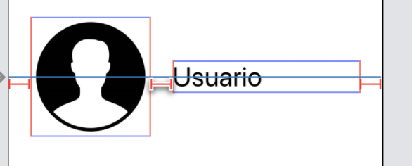

# Interfaz de usuario en dispositivos móviles
## iOS, sesión 3: Autolayout


---


Cuando diseñamos una interfaz, esta debería verse correctamente en cualquier dispositivo, independientemente de la resolución real.

<!-- .element class="stretch" -->


---

El mecanismo estándar que ofrece iOS para diseñar interfaces que se adapten a la resolución de pantalla se denomina **Autolayout**

---

## Puntos a tratar

1. Qué es *autolayout*. Restricciones
2. Manipulación de restricciones con Xcode
3. *Stack Views*
4. Más sobre las restricciones
5. Manipulación de restricciones en Swift


---

# 1. Qué es autolayout. Restricciones

---

**Autolayout** es un sistema declarativo y basado en restricciones. 

Las **restricciones** sirven para calcular automáticamente el *frame* de cada componente y adaptar la interfaz a las dimensiones reales de la pantalla.

<!-- .element class="stretch" -->


---

## El Autolayout es complicado, salvo para...


---

## Tipos de restricciones y ejemplos de cada una

- De alineación ("**align**")
    + Centrar horizontal o verticalmente
    + Alinear varios componentes entre sí
- De espaciado ("**pin**")
    + Que haya determinado espacio entre componentes
    + Que haya determinado espacio entre un componente y el borde izquierdo de la pantalla
    + Fijar el ancho o alto de un componente
    + Fijar el *aspect ratio* de un componente
    + Que dos componentes tengan el mismo alto o ancho

---

## Algunas pistas

En general, **para cada dimensión hacen falta dos restricciones**

<!-- .element class="stretch" -->


---

## Algunas pistas (II)

Algunos elementos, como las etiquetas, botones, imágenes o campos de texto, tienen un **tamaño intrínseco**. Es decir, tienen un tamaño predeterminado (normalmente el del contenido) y **para cada dimensión solo hace falta una restricción** más. 

<!-- .element class="stretch" -->


---

# 2. Manipular restricciones visualmente con Xcode


---

## Varias formas de crear restricciones

- Área de botones de la parte inferior derecha del *storyboard*
- Menú `Editor`
- Uso del ratón


---

## Demo en Xcode

---

# 3. *Stack Views*

---

## *Stack View*

Desde iOS9, para crear fácilmente *layouts* de elementos en disposición vertical u horizontal. Así solo hay que especificar las restricciones del *stack view* como un bloque, no de cada componente por separado

<!-- .element class="stretch" -->


---

## Propiedades de un *stack view*

Podemos indicar cómo se reparten el espacio disponible, dejar un espacio adicional entre ellos, ...


---

## Anidar *stack views*

Podemos tener *stack views* dentro de otras

<div>

</div>

---

# 4. Más sobre las restricciones


---

## Las restricciones formalmente

- Internamente, cada restricción es una ecuación lineal:

```swift
item1.atributo1 = multiplicador * item2.atributo2 + cte
```

- Algunas restricciones no son ecuaciones sino *inecuaciones*, sustituyendo el símbolo `=` por `<=` o `>=`.

Es decir, *autolayout* **está resolviendo un sistema de ecuaciones lineales** sujeto a restricciones

- Las propiedades de la restricción se pueden ver en el *size inspector*

---

## Prioridades

- Cada restricción tiene asignada una **prioridad**, valor numérico que especifica su “importancia” 
- El valor por defecto es 1000 -> la restricción **debe cumplirse**
- Valores<1000 -> se intentará cumplir la restricción pero es posible que no  se cumpla si hay restricciones contradictorias de mayor prioridad.

---


Hay casos en los que puede ser necesario "comprimir" o "ensanchar" los componentes para cumplir las restricciones

  

En este caso el *layout* es ambiguo, sobra espacio horizontal. ¿Se debería ensanchar el *label* o la imagen?

---

## "Prioridades" de los componentes

Los componentes que tienen un tamaño intrínseco intentan mantenerlo así pero se pueden definir prioridades

- *Compression resistance* prioridad con la que un componente intentará evitar ser comprimido (en Xcode actual por defecto todos 750)
- *Content hugging*, prioridad con la que un componente intentará evitar ser expandido (en Xcode actual por defecto todos 251)

---


# 5. Manipulación de restricciones por código

---

## A veces la interfaz de Xcode no es suficiente

- A veces los elementos de la interfaz se crean dinámicamente en tiempo de ejecución
- Otras veces queremos que cambien dinámicamente las restricciones para cambiar dinámicamente el *layout* o hacer animaciones

---

## Métodos para formular una restricción con código

- Usar directamente el API de autolayout
- Usar el *Visual Format language* (recomendado frente al anterior, más intuitivo)

---

## Ejemplo con el API: crear la restricción

Estamos en un *controller* y tenemos la vista asociada, `self.view` y un *outlet* `self.boton` que representa un botón. Queremos que

```swift
self.view.centerX = 1*self.boton.centerX+0
```

En código Swift

```swift
//Esto sirve para que el sistema no añada restricciones propias
self.boton.translatesAutoresizingMaskIntoConstraints = false;
//creamos la restricción
let centrarX = NSLayoutConstraint(item: self.view,
                     attribute: .centerX,
                     relatedBy: .equal,
                     toItem: self.boton,
                     attribute: .centerX,
                     multiplier: 1.0,
                     constant: 0.0)
//la activamos                     
centrarX.isActive = true
```


---

## Visual Format language

“representación en modo texto” de la gráfica de las restricciones. El formato permite **representar un conjunto de restricciones con una cadena de caracteres**.

Ejemplo: separación estándar (8 pixels) entre el botón 1 y el 2

```swift
[boton1]-[boton2]
```

---

## Más cadenas de formato

```swift
[boton1]-20-[boton2] //separación de 20 puntos
[boton1(50)]-20-[boton2(>=50)] //entre paréntesis el ancho 
[boton1]-20@800-[boton2] //prioridades con la @
[boton1]-20-[boton2(==boton1)] //==, mismo tamaño
V:[topField]-10-[bottomField]  //V -> *layout* en vertical
|-[find]-[findNext]-[findField(>=20)]-| //Las barras son los bordes del contenedor 
```

---

## Ejemplo con código

```swift
let constraint = NSLayoutConstraint.constraints(
                   withVisualFormat:"[boton1]-[boton2]",
                   options: .alignAllCenterY, 
                   metrics: nil,   //para ctes. simbólicas en la restricción
                   views:viewsDict)
```

```swift
let b1 = UIButton()  
let b2 = UIButton()
let viewsDict = ["boton1":b1, "boton2":b2]
```

