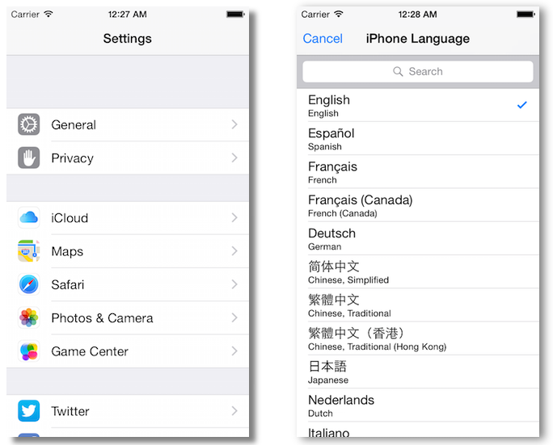
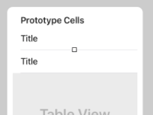
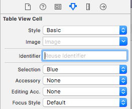

# Interfaz de usuario en dispositivos móviles
## iOS, sesión 4: Tablas


---

Las tablas están por todos lados en iOS. Su aspecto es bastante configurable

<!-- .element class="stretch" -->


---

## Tablas agrupadas/sin agrupar




---

## Estilos de las celdas

- Predefinidos: por defecto, subtítulo, value1, value2
- Personalizados (en el *storyboard* o por código)


---

## Estilos value1 y value2


---

## Puntos a tratar

1. Tablas estáticas 
2. Tablas dinámicas
2. Mostrar tablas dinámicas: el *datasource*
3. Editar tablas dinámicas: el *delegate*

---

# 1. Tablas estáticas

---

## Tablas estáticas

- El número y tamaño de filas y secciones es conocido con anterioridad. Que sean estáticas no quiere decir que el contenido no pueda cambiar
- Usadas simplemente para organizar mejor la información

---

# 2. Tablas dinámicas

---

## Tablas dinámicas

- Normalmente no conocemos el número de datos en tiempo de compilación
- Se pueden añadir/eliminar filas y/o secciones


---

## Necesario para una tabla dinámica

+ La tabla en sí (una *table view*)
+ El **datasource**, al que el *controller* le va pidiendo datos dinámicamente
+ El **delegate** (opcional). gestiona algunos eventos de edición y algunos aspectos de la apariencia de las celdas

En ejemplos sencillos es común que el mismo objeto esté en los tres papeles (normalmente el *view controller* de la pantalla). iOS nos ofrece una clase de este tipo, el `UITableViewController`


---

## Insertar la tabla en una pantalla

- Arrastrar un componente `table view`
- Crear "prototipos de celda": diseños básicos de celda que se van a repetir. **Como mínimo debe haber uno** (la cantidad es la propiedad `Prototype Cells` de la tabla) 
- Editar el prototipo: seleccionar el prototipo de entre los creados, en la parte titulada `Prototype Cells` 



---

   - Elegimos un `Style` de entre los predefinidos, o bien `custom`
   - **Debemos asignarle un identificador (`Identifier`)** arbitrario, luego veremos dónde aparece este en el código



---

# 3. Mostrar datos en tablas dinámicas: el *datasource*

---

Un *datasource* es un caso concreto del patrón de diseño *delegación*: la tabla delega en otro objeto la responsabilidad de **conocer los datos que hay que mostrar en cada celda**. La tabla pinta en pantalla, pero el contenido de las celdas lo debe devolver el *delegado*. 


---

Pasos:

1. Implementar la clase del *datasource*
    - La clase debe declarar que cumple el protocolo `UITableViewDatasource`
    - Debemos escribir el código necesario para dibujar la tabla
2.  Conectar componente de UI con *datasource*: gráficamente o por código


---

## Paso 1a: Clase del *datasource*

además del protocolo propio del `DataSource`, debe implementar `NSObjectProtocol`. La forma más sencilla de conseguirlo es heredando de `NSObject`

```swift
import Foundation
import UIKit

class MiDataSource : NSObject, UITableViewDataSource {
    var datos = ["Uno", "Dos", "Tres",...]

    //Ahora veremos qué métodos debemos implementar

}
```


---


Una idea clave: la vista de tabla **no necesita todos los datos** simultáneamente, **solo los que se ven en pantalla**, por eso los va pidiendo al *datasource* cuando los necesita


---

## Paso 1b: Implementar los métodos del *datasource*

Hay dos métodos obligatorios en el protocolo `UITableViewDataSource`:

- Uno que debe devolver el número de filas en una determinada sección (este es el fácil)
    
```swift
func tableView(_ tableView: UITableView,
               numberOfRowsInSection section: Int) -> Int {
     return self.datos.count
}
```


---

Otro que devuelva un objeto celda correspondiente a un determinado número de fila y sección (este es el difícil)

**(versión ingenua)**


```swift
func tableView(_ tableView: UITableView, 
               cellForRowAt indexPath: IndexPath) -> UITableViewCell {
    //instanciamos una nueva celda
    let celda = UITableViewCell(style: .default, reuseIdentifier: "")
    //la rellenamos de contenido
    celda.textLabel?.text = self.datos[indexPath.row]
    return celda
}
```

---

El anterior método es **ineficiente**. Creamos un **nuevo objeto** cada vez. ¿no podríamos **reutilizar** los objetos ya creados rellenándolos con datos nuevos? (==celdas *reciclables*)

Como mucho necesitamos las celdas que caben en pantalla, el resto serán reutilizadas

---

## Reutilizando las celdas

```swift
 func tableView(_ tableView: UITableView, cellForRowAt indexPath: IndexPath) -> UITableViewCell {
    let nuevaCelda = tableView.dequeueReusableCell(withIdentifier: "unaCelda", for: indexPath)
    nuevaCelda.textLabel?.text = datos[indexPath.row]
    return nuevaCelda
}
```

---

## Paso 2: Conexión tabla -> *datasource*

Aquí lo vemos por código (para hacerlo gráficamente, ver los apuntes). Vamos a hacerlo en el *controller* de la pantalla que contiene a la tabla

Suponemos definido un *outlet* que representa a la tabla y una propiedad que representa al datasource 

```swift
@IBOutlet weak var miTabla: UITableView!
var miDS : MiDataSource!
```

Haremos:

```swift
override func viewDidLoad() {
    super.viewDidLoad()
    // Do any additional setup after loading the view, typically from a nib.
    self.miDS = MiDataSource()
    self.miTabla.dataSource = miDS
}
```

---

# 4. Editar datos en tablas dinámicas: el *delegate*

---

El mismo patrón *delegación* de antes. Ahora la tabla delega en otro objeto las tareas de edición y borrado. Gráficamente es el componente tabla (`UITableView`) el encargado de la parte visual de insertar/eliminar filas, pero es el *delegate* el que se encarga de decidir qué fila/s se pueden borrar, qué hacer cuando se selecciona una celda, cómo mostrar títulos de sección, etc.

Editar es realmente una colaboración entre *datasource* y *delegate*. El único que puede editar de verdad es el *datasource*, que es el que tiene acceso a los datos.


---

## El *delegate*

- Debe implementar el protocolo `UITableViewDelegate`

```swift
import Foundation
import UIKit

class MiDelegate : NSObject, UITableViewDelegate {
   //Implementación de la clase
}
```

- Los métodos para seleccionar y editar se deben implementar en él

---

## Seleccionar celdas

 - El designado como *delegate* recibirá una llamada a este método
 - En este ejemplo añadimos una marca de verificación a la celda sobre la que hemos hecho *tap*, y la quitamos si ya la tenía

```swift
func tableView(_ tableView: UITableView, didSelectRowAt indexPath: IndexPath) {
    if let celda = tableView.cellForRow(at: indexPath) {
        if celda.accessoryType==UITableViewCellAccessoryType.none {
            celda.accessoryType = .checkmark
        }
        else {
            celda.accessoryType = .none
        }
        tableView.deselectRow(at: indexPath, animated: true)
    }
}
```


---

## Poner/quitar modo edición


```swift
//En el controller, esto es un outlet
@IBOutlet weak var miTabla: UITableView!

//Esto estaría en algún método del controller
if !self.miTabla.isEditing {
   self.miTabla.setEditing(true, animated: true)
}
else {
    self.miTabla.setEditing(false, animated: true)
}
```

---

## Estilo de edición

- El estilo "delete" muestra una señal de "prohibido" en la izquierda, indicando que si la pulsamos podemos borrar la celda
- El "insert" muestra un "+"

```swift
func tableView(_ tableView: UITableView, editingStyleForRowAt indexPath: IndexPath) -> UITableViewCellEditingStyle {
    //Ponemos un botón "insert" en la última fila
    if indexPath.row==tableView.numberOfRows(inSection:0)-1 {
        return UITableViewCellEditingStyle.insert
    }
    else {
        return UITableViewCellEditingStyle.delete
    }
}
```

---

## Editar filas con los botones del sistema 

Esto es en el *datasource*, no en el *delegate*

```swift
func tableView(_ tableView: UITableView, commit editingStyle: UITableViewCell.EditingStyle, forRowAt indexPath: IndexPath) {
    if editingStyle==UITableViewCell.EditingStyle.delete {
        self.datos.remove(at: indexPath.row)
        tableView.deleteRows(at: [indexPath], with: UITableView.RowAnimation.fade)
    }
    else if editingStyle==UITableViewCellEditingStyle.insert {
        self.datos.insert("Nueva celda", at: indexPath.row)
        tableView.insertRows(at: [indexPath], with: UITableView.RowAnimation.bottom)
    }
}
```

---

## Insertar una celda "manualmente"

Con "manualmente" queremos decir que los que disparamos la acción somos nosotros, no iOS con los botones del sistema

Esto es en realidad tarea del *datasource*

Suponemos que podemos acceder de algún modo a la `tabla` (el objeto de la interfaz de usuario, `UITableView`)

```swift
//AQUI ESTAMOS INSERTANDO EN LA POSICION 0, HABRIA QUE CAMBIARLO
//Actualizar datos
self.datos.insert("Nueva celda", at:0)
//Actualizar visualmente la tabla
let indexPath = IndexPath(row:0,section:0)
tabla.insertRows(at: [indexPath], with: UITableViewRowAnimation.fade)
```


